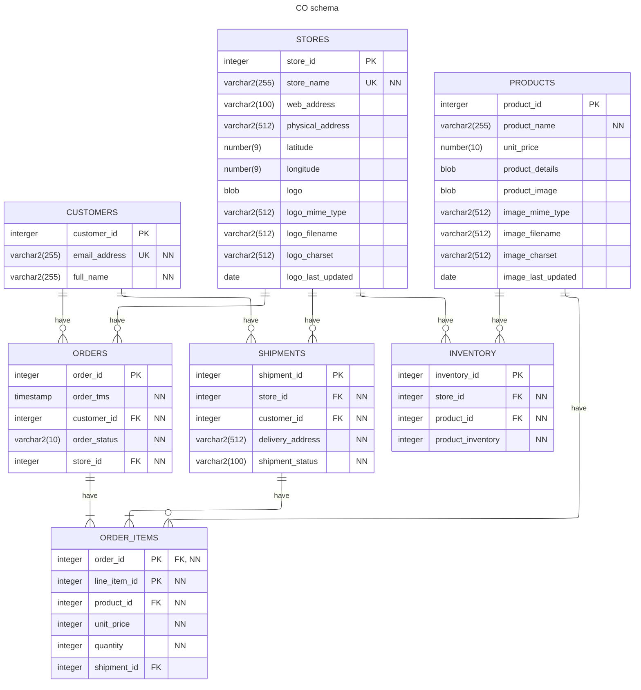

# Lab6: Customer Gift Package Reward Manager (Nested Tables + Packages + CASE)
In this lab, we aim to work on the Customer-Order database that we installed in lab2. The schema of this database is provided in this assignment. You will need to use this schema in order to complete the lab. 


### Schema Diagram


## Part A — Create Gift Types and GIFT_CATALOG Table (Nested Tables)
(8 marks)
1.	Create a nested table type to store multiple gift items (e.g., 'Teddy Bear', 'Chocolate Box').
2.	Create a table GIFT_CATALOG with the following columns:
     - GIFT_ID — PRIMARY KEY
     - PURCHASE_AMOUNT — the purchase amount to qualify for the gift package
     - a nested table of gift items (use the type created above)
3. Configure nested table storage:
```
NESTED TABLE gifts STORE AS <your_storage_table>;
```
4. Insert at least three gift packages, each containing multiple gift items.
  	
